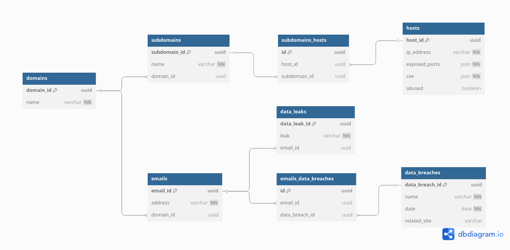

# Informal Description
## Tables

- **domains**:
    - `domain_id` (UUID)
    - `name` (string)

- **subdomains**:
    - `subdomain_id` (UUID)
    - `name` (string)
    - `domain_id` (UUID)

- **hosts**:
    - `host_id` (UUID)
    - `ip_address` (string)
    - `exposed_ports` (JSON) — [example](#exposed_ports)
    - `cve` (JSON) — [example](#cve)
    - `abused` (boolean)

- **subdomains_hosts**:
    - `id` (UUID)
    - `host_id` (UUID)
    - `subdomain_id` (UUID)

- **emails**:
    - `email_id` (UUID)
    - `address` (string)
    - `domain_id` (UUID)

- **data_breaches**:
    (To be populated as new data breaches are discovered via API responses)
    - `data_breach_id` (UUID)
    - `name` (string)
    - `date` (date)
    - `related_site` (string)

- **emails_data_breaches**:
    - `email_id` (UUID)
    - `data_breach_id` (UUID)

- **data_leaks**:
    (An instance of this table represents a leak)
    - `data_leak_id` (UUID)
    - `leak` (string) — e.g., `info@example.com:password`
    - `email_id` (UUID)


## Examples
### exposed_ports: 
```JSON
{
    "22": {
        "protocol": "SSH",
        "softwares": [
            "OpenSSH",
            "Dropbear"
        ]
    },
    "80": {
        "protocol": "HTTP",
        "softwares": [
            "Apache",
            "Nginx"
        ]
    },
    "443": {
        "protocol": "HTTPS",
        "softwares": [
            "Apache",
            "Nginx"
        ]
    }
}
```

### cve: 
```JSON
{
    "CVE-2023-1234": {
        "description": "Description of CVE-2023-1234",
        "severity": "high"
    },
    "CVE-2023-5678": {
        "description": "Description of CVE-2023-5678",
        "severity": "medium"
    }
}
```

# DBML
```sql
Table domains {
    domain_id uuid [default: "gen_random_uuid()", primary key]
    name varchar [not null]
}

Table subdomains {
    subdomain_id uuid [default: "gen_random_uuid()", primary key]
    name varchar [not null]
    domain_id uuid [ref: > domains.domain_id]
}

Table hosts {
    host_id uuid [default: "gen_random_uuid()", primary key]
    ip_address varchar [not null]
    exposed_ports json [not null]
    cve json [not null] 
    abused boolean [default: false]
}

Table subdomains_hosts {
    id uuid [default: "gen_random_uuid()", primary key]
    host_id uuid [ref: > hosts.host_id]
    subdomain_id uuid [ref: > subdomains.subdomain_id]
}

Table emails {
    email_id uuid [default: "gen_random_uuid()", primary key]
    address varchar [not null]
    domain_id uuid [ref: > domains.domain_id]
}

Table data_breaches {
    data_breach_id uuid [default: "gen_random_uuid()", primary key]
    name varchar [not null]
    date date [not null]
    related_site varchar
}

Table emails_data_breaches {
    id uuid [default: "gen_random_uuid()", primary key]
    email_id uuid [ref: > emails.email_id]
    data_breach_id uuid [ref: > data_breaches.data_breach_id]
}

Table data_leaks {
    data_leak_id uuid [default: "gen_random_uuid()", primary key]
    leak varchar [not null]
    email_id uuid [ref: > emails.email_id]
}
```

# DDL
```sql
CREATE TABLE domains (
    domain_id uuid DEFAULT gen_random_uuid() PRIMARY KEY,
    name VARCHAR NOT NULL
);

CREATE TABLE subdomains (
    subdomain_id uuid DEFAULT gen_random_uuid() PRIMARY KEY,
    name VARCHAR NOT NULL,
    domain_id uuid REFERENCES domains(domain_id)
);

CREATE TABLE hosts (
    host_id uuid DEFAULT gen_random_uuid() PRIMARY KEY,
    ip_address VARCHAR NOT NULL,
    exposed_ports JSON NOT NULL,
    cve JSON NOT NULL,
    abused BOOLEAN DEFAULT FALSE
);

CREATE TABLE subdomains_hosts (
    id uuid DEFAULT gen_random_uuid() PRIMARY KEY,
    host_id uuid REFERENCES hosts(host_id),
    subdomain_id uuid REFERENCES subdomains(subdomain_id)
);

CREATE TABLE emails (
    email_id uuid DEFAULT gen_random_uuid() PRIMARY KEY,
    address VARCHAR NOT NULL,
    domain_id uuid REFERENCES domains(domain_id)
);

CREATE TABLE data_breaches (
    data_breach_id uuid DEFAULT gen_random_uuid() PRIMARY KEY,
    name VARCHAR NOT NULL,
    date DATE NOT NULL,
    related_site VARCHAR NOT NULL
);

CREATE TABLE emails_data_breaches (
    id uuid DEFAULT gen_random_uuid() PRIMARY KEY,
    email_id uuid REFERENCES emails(email_id),
    data_breach_id uuid REFERENCES data_breaches(data_breach_id)
);

CREATE TABLE data_leaks (
    data_leak_id uuid DEFAULT gen_random_uuid() PRIMARY KEY,
    leak VARCHAR NOT NULL,
    email_id uuid REFERENCES emails(email_id)
);
```

# ERD
